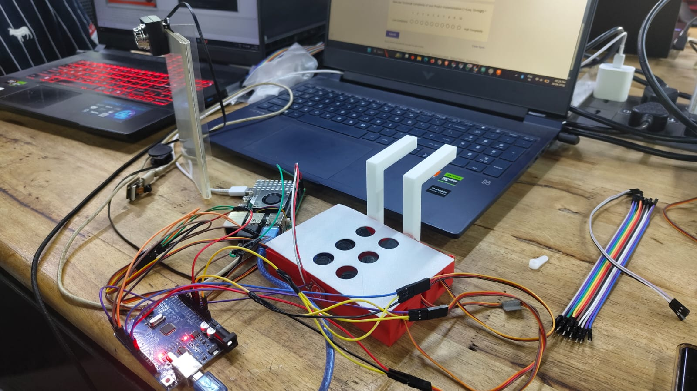
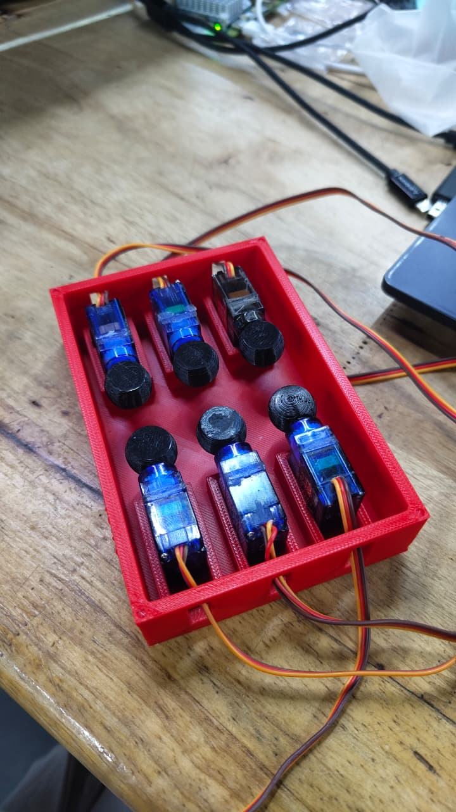

# DynaBraille 🖐️

> **AI-powered reading desk for blind students** — scans physical textbook pages via camera, performs bilingual OCR (English + Malayalam), cleans text with a local Gemma LLM, speaks aloud through headphones, and renders each character on a custom-built dynamic Braille refresh cell driven by Arduino.

---

## 📸 Gallery

### Desk Setup & Hardware


### Braille Cell Servo Assembly



### Full System Working Flow
[](https://youtube.com/shorts/Nej_g_eKN2o)
> 📺 Click the thumbnail above to watch the full system working demo on YouTube.

### Dynamic Braille Cell Loading Alphabets
[](https://youtube.com/shorts/mgscIVhc7ok)
> 📺 Click the thumbnail above to watch the Braille cell cycle through alphabets on YouTube.

---

## How It Works

A blind student places their textbook under the camera and says **"scan"** (or presses a button). Within seconds, DynaBraille:

1. **Captures** the sharpest frame from the Pi Camera
2. **Detects** the page boundary and corrects perspective distortion
3. **Deskews** and enhances the image for OCR
4. **Runs bilingual OCR** — PaddleOCR for English, Tesseract for Malayalam — selecting the winner by confidence score
5. **Cleans** the raw OCR output using a local Gemma 2B LLM (via Ollama)
6. **Speaks** the result aloud through headphones using TTS
7. **Streams** the text to a custom Braille cell — one character at a time — via Arduino over UART serial

---

## Hardware

| Component | Details | Role |
|---|---|---|
| **Raspberry Pi 5** | Main compute board | Runs all AI, OCR, TTS, voice recognition |
| **Pi Camera 3** | 2304×1296 resolution | Page capture |
| **Headphones (TRRS)** | Mic + speaker in one | Voice command input + TTS audio output |
| **Arduino Uno** | ATmega328P | Receives text over UART, drives servos |
| **6× Micro Servo (SG90)** | 2×3 grid arrangement | Each servo raises/lowers one Braille dot pin |
| **3D-printed cell housing** | Custom red PLA enclosure | Holds servos in standard Braille 2×3 dot pattern |
| **Push buttons** | GPIO connected | Physical control (scan, read, next word, etc.) |
| **Touch sensor** | Mounted on the side of the Braille cell | Thumb-press to advance to the next word while fingers stay on the dots |

### Braille Cell Design

The Braille cell uses **6 SG90 micro servo motors** arranged in the standard Grade-1 Braille pattern (2 columns × 3 rows). Each servo arm has a Braille dot pin attached — rotating the servo arm raises or lowers the pin through the top plate, forming any Braille character.

The Raspberry Pi 5 sends characters over UART to the Arduino Uno, which interprets a `BRAILLE:xxxxxx\n` packet (6-bit pattern, one `0`/`1` per dot) and positions each servo accordingly.

```
Dot layout:        Packet format:
  1  4             BRAILLE:100100\n
  2  5                     ^^^^^^
  3  6                     dots 1-6
```

### Touch Sensor — Next Word Advance

A **touch sensor is mounted on the side of the Braille cell housing**. While the student's fingers rest on the Braille dots to read, they press the sensor with their thumb on the side to advance to the next word. The Arduino detects the touch and sends a `NEXT` signal to the Pi over UART, which loads and renders the next word on the cell. The student's hands **never leave the device** while reading.

---

## Software Architecture

```
Voice / Button input
        │
        ▼
  Intent Parser (rule-based → Gemma fallback)
        │
        ├── SCAN ──────────────────────────────────────────────┐
        │        Pi Camera captures sharpest of 3 frames       │
        │        → Perspective warp (page detection)           │
        │        → Deskew (skew angle correction)              │
        │        → CLAHE contrast enhance + denoise            │
        │        → PaddleOCR (English) — real confidence score │
        │             ≥ 0.80  → accept English                 │
        │             0.60–0.80 → run both, pick winner        │
        │             < 0.60  → Tesseract Malayalam            │
        │        → Gemma 2B cleans OCR noise (local, offline)  │
        │        → Page number extracted from bottom strip     │
        │                                                       │
        ├── READ / NEXT_WORD / NEXT_LINE                        │
        │        Speaks buffered text via pyttsx3 TTS ◄────────┘
        │        Streams to Braille cell via serial UART
        │        ← also triggered by touch sensor tap on cell
        │
        ├── EXPLAIN / SUMMARY / DESCRIBE
        │        Gemini 1.5 Flash (cloud) — explains / summarizes
        │        page text or describes diagrams in the camera frame
        │
        └── GO_TO_PAGE
                 Navigation guidance (pages forward/backward)
```

### Module map

| Module | File | What it does |
|---|---|---|
| Entry point | `main.py` | `BrailleDesk` class, intent dispatch, voice loop |
| Config | `config.py` | All tuneable parameters |
| OCR | `modules/ocr.py` | Bilingual pipeline (PaddleOCR + Tesseract) |
| Camera | `modules/camera.py` | picamera2 wrapper, sharpest-frame capture |
| Gemma | `modules/gemma.py` | OCR cleanup, Braille compression, intent fallback |
| Gemini | `modules/gemini.py` | Explain, summarize, Q&A, image description |
| TTS | `modules/tts.py` | pyttsx3 speech output |
| Voice | `modules/voice.py` | SpeechRecognition → Google ASR → Vosk fallback |
| Braille | `modules/braille.py` | Text → Grade-1 cells → Arduino serial |
| Buttons | `modules/buttons.py` | RPi.GPIO physical button handler |
| Arduino | `arduino/` | Servo control sketch (receives UART packets) |

---

## 🛠️ Replicating & Extending the Hardware

If you want to build your own DynaBraille unit, the most custom part is the Braille cell.

### 1. Build the Braille Cell
- **3D Print the Housing:** The housing needs 6 slots fitted for SG90 micro servos in a 2x3 grid. The top plate must have 6 corresponding holes for the Braille pins.
- **Servos & Pins:** Attach a small pin or lever to each servo horn. When the servo actuates, the pin should protrude through the top plate.
- **Touch Sensor:** Mount a capacitive touch sensor on the side of the housing where the user's thumb naturally rests.

### 2. Wire the Arduino
- Connect the 6 servo signal wires to the PWM pins on the Arduino Uno.
- Connect the side touch sensor to a digital input pin.
- Supply adequate power (5V) to the servos; do not power all 6 servos directly from the Arduino's 5V pin, as they may draw too much current. Use an external 5V power supply.

### 3. Test the Assembly
Once the Arduino is wired and the sketch is flashed, you can test the Braille cell independently without running the full AI pipeline:
```bash
# Smoke test: cycles through 'HELLO', 'abc123', and all-down
python tests/test_arduino.py

# Test a single dot (e.g., dot 1)
python tests/test_arduino.py --single 1
```

---

## Setup

### 1. System dependencies

```bash
# Tesseract OCR engine + Malayalam language pack
sudo apt install tesseract-ocr tesseract-ocr-mal

# espeak for TTS
sudo apt install espeak

# Audio (for headphone mic input)
sudo apt install portaudio19-dev
```

### 2. Python dependencies

```bash
pip install -r requirements.txt
```

> **PaddleOCR note:** `paddlepaddle` and `paddleocr` are CPU builds by default.
> Set `PADDLE_USE_GPU = True` in `config.py` if you have a CUDA-capable device.

### 3. Ollama + Gemma (local LLM)

```bash
# Install Ollama
curl -fsSL https://ollama.com/install.sh | sh

# Pull Gemma 2B (fits comfortably on Pi 5 with 8GB RAM)
ollama pull gemma2:2b

# For 4GB Pi, use the smaller variant:
# ollama pull gemma3:1b
# and update GEMMA_MODEL in config.py
```

### 4. Gemini API key (optional — cloud features only)

```bash
export GEMINI_API_KEY="your_key_here"
```

> Without this key, explain/summary/image-description features are disabled.
> Core scan, read, and Braille output work fully offline.

### 5. Arduino sketch

Flash the sketch in `arduino/` to the Uno using Arduino IDE.
Connect the Uno to the Pi 5 via USB. Verify the port in `config.py`:

```python
SERIAL_PORT = "/dev/ttyACM0"   # Uno → ttyACM0 | Nano → ttyUSB0
```

---

## Running

```bash
python main.py
```

### CLI flags

| Flag | Effect |
|---|---|
| `--no-braille` | Skip Arduino / Braille cell output |
| `--no-gemma` | Skip local Gemma OCR cleanup |
| `--no-gemini` | Skip cloud Gemini features |
| `--no-voice` | Keyboard input only (no microphone) |

**Fully offline / edge mode:**
```bash
python main.py --no-gemini
```

---

## Voice Commands

| Say | Action |
|---|---|
| `scan` | Capture and OCR the current page |
| `read` | Read the full page aloud |
| `next word` | Speak + Braille the next word |
| `next line` | Speak + Braille the next line |
| `repeat` | Repeat the last spoken text |
| `explain` | Gemini explains the page in simple language |
| `summarize` | Gemini summarizes the page in 3 sentences |
| `spell` | Spell the current word letter by letter |
| `braille` | Send first 40 characters to the Braille cell |
| `go to page 42` | Navigation guidance to page 42 |
| `stop` | Stop current output |

All commands also have matching **physical push buttons** (configurable GPIO pins in `config.py`).

---

## Configuration

All parameters live in `config.py`:

```python
# Camera
CAMERA_RESOLUTION = (2304, 1296)   # Pi Camera 3 native

# Bilingual OCR engine switching
PADDLE_ENABLED     = True          # False → Tesseract English only (lighter)
MALAYALAM_ENABLED  = True          # False → English only
OCR_HIGH_CONF      = 0.80          # Above this → accept PaddleOCR directly
OCR_LOW_CONF       = 0.60          # Below this → switch to Malayalam Tesseract
TESSDATA_DIR       = ""            # Path to local tessdata/ folder

# Local AI
OLLAMA_URL         = "http://localhost:11434"
GEMMA_MODEL        = "gemma2:2b"   # "gemma3:1b" for 4GB Pi

# Cloud AI
GEMINI_API_KEY     = ""            # Set via env var GEMINI_API_KEY
GEMINI_MODEL       = "gemini-1.5-flash"

# Braille cell timing
BRAILLE_SETTLE_MS  = 400           # Servo settle time between cells
SERIAL_PORT        = "/dev/ttyACM0"
SERIAL_BAUD        = 9600
```

---

## Project Structure

```
DynaBraille/
├── main.py              # Application entry point (BrailleDesk class)
├── config.py            # All configuration parameters
├── requirements.txt     # Python dependencies
├── setup.sh             # One-shot setup script
├── arduino/             # Arduino servo-driver sketch
├── modules/
│   ├── ocr.py           # Bilingual OCR pipeline (PaddleOCR + Tesseract)
│   ├── camera.py        # Pi Camera 3 / USB camera wrapper
│   ├── gemma.py         # Local Gemma LLM (OCR cleanup, intent parsing)
│   ├── gemini.py        # Cloud Gemini AI (explain, summarize, vision)
│   ├── braille.py       # Text → Grade-1 Braille → Arduino UART
│   ├── tts.py           # Text-to-speech (pyttsx3 / espeak)
│   ├── voice.py         # Voice recognition (Google ASR + Vosk fallback)
│   └── buttons.py       # Physical GPIO button handler
└── tests/               # Unit tests
```

---

## Offline / Edge Capability

| Feature | Online? | Offline? |
|---|---|---|
| OCR (English + Malayalam) | ✅ | ✅ |
| Gemma OCR cleanup | ✅ | ✅ (Ollama runs locally) |
| TTS speech output | ✅ | ✅ (espeak, no internet) |
| Braille cell output | ✅ | ✅ |
| Voice recognition | ✅ | ⚠️ Vosk needed (see config) |
| Gemini explain/summarize | ✅ | ❌ (cloud API) |

Run with `--no-gemini` for a fully air-gapped deployment.

---

## License

MIT
